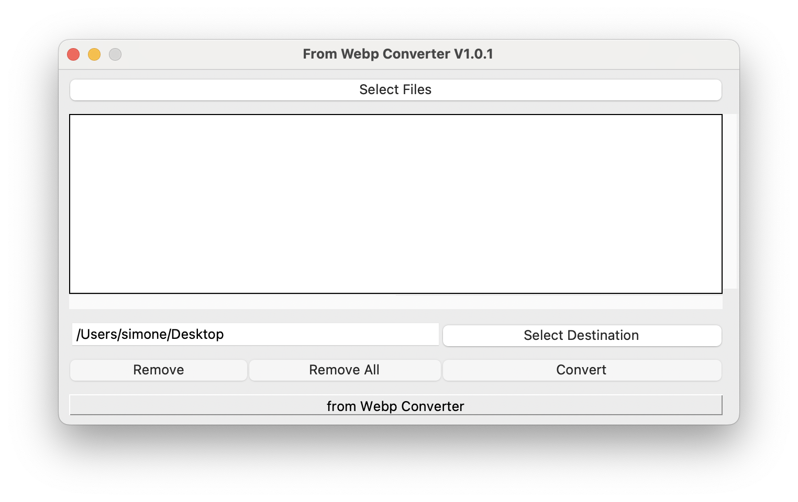

# From WebP Converter

A simple Python application to convert **WebP** images into **JPG**, **PNG**, or **GIF** formats. The application automatically detects the type of WebP image:

* **JPG** for standard photos
* **PNG** for images with transparency
* **GIF** for animated images

The program features a graphical user interface built with **Tkinter**.

## Features

* Automatic format detection (JPG, PNG, GIF)
* Simple and user-friendly GUI
* Easy installation and usage
* Free and open-source (GPL-3.0 License)

## License

This project is licensed under the **GPL-3.0 License**. See the LICENSE file for details.

## Screenshots

